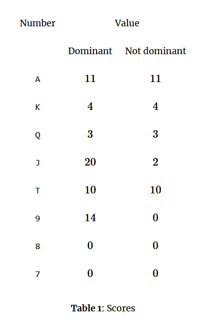

# Bela

Young Mirko is a smart, but mischievous boy who often wanders around parks looking for new ideas. This time he’s come across pensioners playing the card game Belote. They’ve invited him to help them determine the total number of points in a game.

Each card can be uniquely determined by its number and suit. A set of four cards is called a hand. At the beginning of a game one suit that “trumps” any other is chosen, and it is called the dominant suit. The number of points in a game is equal to the sum of values of each card from each hand in the game. Mirko has noticed that the pensioners have played N
hands and that suit B was the dominant suit.

The value of each card depends on its number and whether its suit is dominant, and is given in Table 1.

Write a programme that will determine and output the number of points in the game.

## Input

The first line contains the number of hands N (1≤N≤100) and the value of suit B (S, H, D, C) from the task. Each of the following 4N lines contains the description of a card (the first character is the number of the i-th card (A, K, Q, J, T, 9, 8, 7), and the second is the suit (S, H, D, C)).

## Output

The first and only line of output must contain the number of points from the task.

## Info

- Problem ID: bela
- CPU Time limit: 1 second
- Memory limit: 1024 MB
- Difficulty: 1.3
- Author: Branimir Filipović
- Source: Croatian Open Competition in Informatics 2015/2016, contest #6
