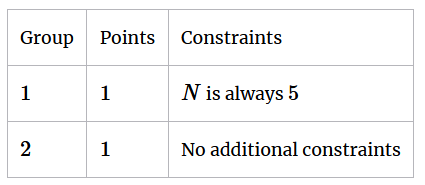

# Odd Echo

ECHO! Echo! Ech...

You love shouting in caves to hear your words echoed back at you. Unfortunately, as a hard-working software engineer you are not lucky enough to get out that often to shout in caves. Instead, you would like to implement a program that serves as a replacement for a cave.

Every now and then, you want to input a few words into the program and have them echoed back to you. However, as is well known, if you shout too quickly in a cave, the echo might cause interference with the new words you say. More specifically, every other word you say will interfere with the echo of your previous word. Thus only the first, third, fifth, and so on, words will actually produce an echo.

Your task is to write a program that simulates this behavior.

## Input

The first line of the input contains an integer N (1≤N≤10).

The next N lines each contains a word. Each word is at most 100 letters long, and contains only letters ‘a-z‘.

## Output

Output the odd-indexed (i.e. first, third, fifth, and so on) words in the input.

## Scoring

Your solution will be tested on a set of test groups, each worth a number of points. To get the points for a test group you need to solve all test cases in the test group.

## Info

- Problem ID: oddecho
- CPU Time limit: 1 second
- Memory limit: 1024 MB
- Difficulty: 1.3
- Author: Johan Sannemo
- Source: Principles of Algorithmic Problem Solving
