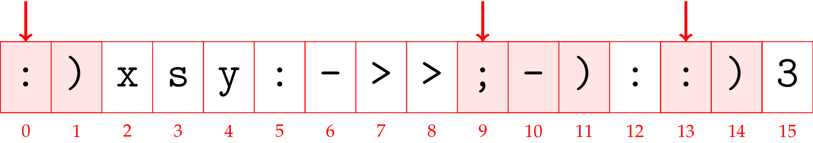

# SMIL

Siffermaskinen i Lund (SMIL, “The Number Machine in Lund”) was a first-generation computer built at Lund University, in operation from 1956 to 1970. It was based on the computer architecture developed by John von Neumann at the Institute of Advanced Studies at Princeton.

Your task is to find the smiles in the memory of SMIL. A smile is sequence of symbols of the form “:)”, “;)”, “:-)”, or “;-)”.

## Input

A single line of at most 2048 symbols, such as letters from the English alphabet, digits, space, and many punctuation marks. (To be precise, the symbols are from the ASCII range 32 to 126.) The line contains at least one “:)”.

## Output

A nonempty sequence of integers, separated by whitespace, of memory addresses at which a smile appears. The order is not important. The address of a smile is the address of the “eyes,” i.e., the first symbol. SMIL’s memory addresses are enumerated 0, 1, …, 2047. The input line starts at address 0.

Here is sample input 1:

## Scoring

You receive 1 point for every smile you can find. There are at most 100 smiles.

Your answer is judged wrong if it is empty or contains an address without a smile.

## Info

- Problem ID: smil
- CPU Time limit: 1 second
- Memory limit: 1024 MB
- Difficulty: 1.3
- Author: Thore Husfeldt
- Source: LTH Challenge 2021
